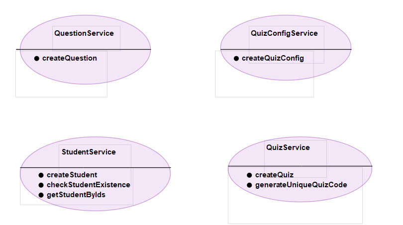
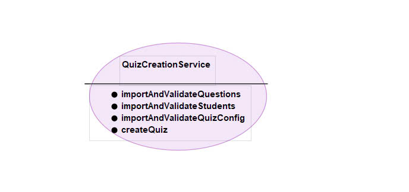
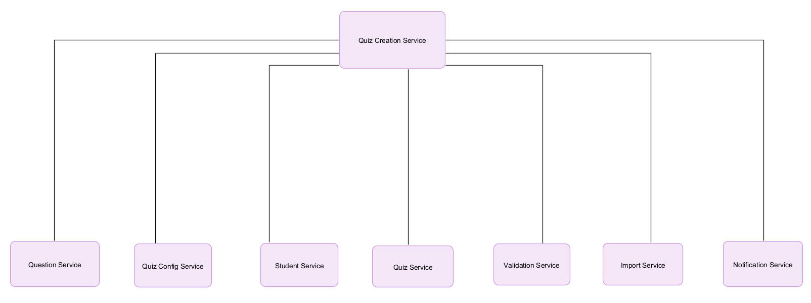
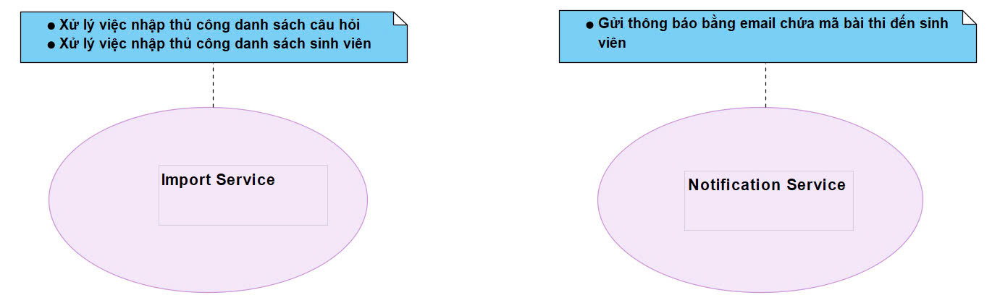
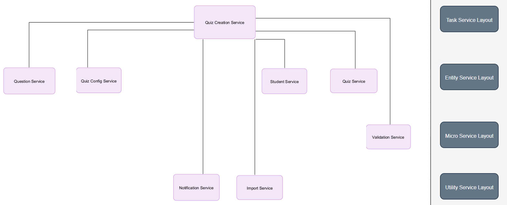

# Phân tích và thiết kế hệ thống

## Giới thiệu

### Vấn đề cần giải quyết

Hệ thống được thiết kế để giải quyết các vấn đề sau:

1. **Quản lý quy trình tạo bài thi trắc nghiệm end-to-end**

Hệ thống đảm bảo quản lý toàn bộ quy trình từ khi giáo viên khởi tạo bài thi, nhập dữ liệu (danh sách câu hỏi, cấu hình bài thi, danh sách sinh viên), xác thực tính hợp lệ, đến khi tạo bài thi thành công và gửi mã bài thi cho sinh viên. Cụ thể:
- Luồng xử lý nhất quán: Quy trình được điều phối bởi Quiz Creation Service, đảm bảo các bước (import, xác thực, lưu trữ, thông báo) được thực hiện tuần tự và đúng thứ tự.
- Trạng thái bài thi tập trung: Quiz Service lưu trữ và quản lý thông tin bài thi, bao gồm mã bài thi, và các thông tin liên quan.
- Thông báo theo thời gian thực: Notification Service gửi mã bài thi thành công đến sinh viên ngay sau khi quy trình hoàn tất.

2. **Xử lý và xác thực dữ liệu nhập vào**

Hệ thống đảm bảo tính hợp lệ của các dữ liệu được nhập vào (danh sách câu hỏi, cấu hình bài thi, danh sách sinh viên) thông qua:
- Phân tách trách nhiệm xác thực: Validation Service chịu trách nhiệm kiểm tra tính hợp lệ của từng loại dữ liệu (câu hỏi, cấu hình, sinh viên), đảm bảo dữ liệu tuân theo định dạng và yêu cầu cụ thể.
- Xử lý lỗi rõ ràng: Nếu bất kỳ dữ liệu nào không hợp lệ ( câu hỏi sai định dạng, cấu hình bài thi không đúng, mã sinh viên bị trùng lặp), hệ thống dừng quy trình và có thông báo lỗi cụ thể đến giáo viên, giúp họ điều chỉnh dữ liệu nhanh chóng.
- Tính toàn vẹn dữ liệu: Question Service, Quiz Config Service, và Student Service đảm bảo dữ liệu được nhập vào hệ thống là chính xác trước khi lưu trữ hoặc sử dụng.

3. **Tự động hóa quy trình nhập liệu và thông báo**

Hệ thống tối ưu hóa quy trình nhập liệu thủ công và cung cấp thông báo tự động để cải thiện trải nghiệm người dùng:
- Nhập liệu thủ công hiệu quả: Import Service hỗ trợ giáo viên nhập danh sách câu hỏi, cấu hình bài thi, và danh sách sinh viên một cách dễ dàng, giảm thiểu sai sót thông qua giao diện thân thiện.
- Tự động hóa thông báo: Notification Service tự động gửi email chứa mã bài thi đến sinh viên khi bài thi được tạo thành công.
- Lưu trữ dữ liệu bài thi: Quiz Service lưu trữ thông tin bài thi vào cơ sở dữ liệu để tham khảo và quản lý sau này, đảm bảo giáo viên có thể tra cứu hoặc chỉnh sửa khi cần.

## Tổng quan Case Study

Trong phần này, chúng ta sẽ phân tích quy trình nghiệp vụ tạo bài thi trắc nghiệm trực tuyến để xác định các ứng viên dịch vụ (service candidates) cho kiến trúc hướng dịch vụ (SOA) của hệ thống. Quy trình này bao gồm các bước từ khi giáo viên khởi tạo bài thi, nhập danh sách câu hỏi, cấu hình bài thi, danh sách sinh viên, xác thực dữ liệu, đến khi tạo bài thi thành công và gửi mã bài thi cho sinh viên.

### Xử lý quy trình nghiệp vụ: Tạo bài thi trắc nghiệm

Quy trình tạo bài thi trắc nghiệm là một quy trình nghiệp vụ phổ biến trong các hệ thống giáo dục trực tuyến, cho phép giáo viên thiết lập bài thi một cách hiệu quả và tự động hóa việc quản lý dữ liệu bài thi. Quy trình này liên quan đến nhiều thành phần khác nhau của hệ thống, từ nhập liệu thủ công, xác thực dữ liệu, lưu trữ bài thi, đến thông báo cho sinh viên.

### Mô tả quy trình nghiệp vụ:

1. **Khởi tạo quy trình tạo bài thi**: Giáo viên truy cập hệ thống và bắt đầu quy trình tạo bài thi trắc nghiệm.
2. **Nhập danh sách câu hỏi**: Giáo viên nhập thủ công danh sách câu hỏi (bao gồm nội dung câu hỏi, đáp án, và đáp án đúng) vào hệ thống thông qua giao diện.
3. **Xác thực danh sách câu hỏi**: Hệ thống kiểm tra tính hợp lệ của danh sách câu hỏi (ví dụ: định dạng đúng, không có câu hỏi trùng lặp, đáp án hợp lệ).
4. **Thông báo lỗi nếu danh sách câu hỏi không hợp lệ**: Nếu danh sách câu hỏi không đáp ứng yêu cầu, hệ thống dừng quy trình và thông báo lỗi chi tiết cho giáo viên.
5. **Nhập cấu hình bài thi**: Giáo viên nhập các thông tin cấu hình bài thi, bao gồm thời gian làm bài, số lượng câu hỏi, thang điểm, và các quy định khác.
6. **Xác thực cấu hình bài thi**: Hệ thống kiểm tra tính hợp lệ của cấu hình (ví dụ: thời gian làm bài hợp lý, số lượng câu hỏi phù hợp với danh sách đã nhập).
7. **Thông báo lỗi nếu cấu hình không hợp lệ**: Nếu cấu hình không hợp lệ, hệ thống dừng quy trình và thông báo lỗi chi tiết cho giáo viên.
8. **Nhập danh sách sinh viên**: Giáo viên nhập danh sách tên hoặc mã sinh viên tham gia bài thi.
9. **Xác thực danh sách sinh viên**: Hệ thống kiểm tra tính hợp lệ của danh sách sinh viên (ví dụ: mã sinh viên tồn tại trong cơ sở dữ liệu, không có trùng lặp).
10. **Thông báo lỗi nếu danh sách sinh viên không hợp lệ**: Nếu danh sách sinh viên không hợp lệ, hệ thống dừng quy trình và thông báo lỗi chi tiết cho giáo viên.
11. **Lưu trữ và tạo bài thi**: Nếu tất cả dữ liệu (câu hỏi, cấu hình, sinh viên) đều hợp lệ, hệ thống lưu trữ dữ liệu và tạo bài thi, sinh mã bài thi duy nhất.
12. **Gửi thông báo thành công**: Hệ thống gửi mã bài thi đến sinh viên qua email và thông báo cho giáo viên rằng quy trình tạo bài thi đã hoàn tất.

### Yêu cầu

- Đảm bảo xác thực tính hợp lệ của danh sách câu hỏi, cấu hình bài thi, và danh sách sinh viên một cách chính xác.
- Tự động hóa quy trình nhập liệu thủ công thông qua giao diện thân thiện.
- Cung cấp thông báo lỗi chi tiết và thông báo thành công theo thời gian thực.
- Lưu trữ thông tin bài thi vào cơ sở dữ liệu để quản lý và tham khảo sau này.
- Đảm bảo tính toàn vẹn dữ liệu trong suốt quá trình tạo bài thi.

## 1. Phân rã quy trình nghiệp vụ

Phân rã quy trình nghiệp vụ là bước đầu tiên trong việc xác định các ứng viên dịch vụ cho hệ thống. Trong bước này, quy trình tạo bài thi trắc nghiệm được chia thành các hành động chi tiết, bao gồm cả các hành động do giáo viên thực hiện và các hành động do hệ thống xử lý. Mục tiêu là xác định các hành động có thể tự động hóa và thuộc phạm vi của các dịch vụ backend.

### Các hành động chi tiết:

1. Nhập danh sách câu hỏi vào hệ thống.
2. Kiểm tra tính hợp lệ của danh sách câu hỏi (định dạng, nội dung, đáp án).
3. Thông báo lỗi nếu danh sách câu hỏi không hợp lệ.
4. Dừng quy trình nếu danh sách câu hỏi không hợp lệ.
5. Nhập cấu hình bài thi (thời gian, số lượng câu hỏi, thang điểm, quy định).
6. Kiểm tra tính hợp lệ của cấu hình bài thi.
7. Thông báo lỗi nếu cấu hình bài thi không hợp lệ.
8. Dừng quy trình nếu cấu hình bài thi không hợp lệ.
9. Nhập danh sách tên hoặc mã sinh viên tham gia bài thi.
10. Kiểm tra tính hợp lệ của danh sách sinh viên (mã sinh viên tồn tại, không trùng lặp).
11. Thông báo lỗi nếu danh sách sinh viên không hợp lệ.
12. Dừng quy trình nếu danh sách sinh viên không hợp lệ.
13. Lưu trữ danh sách câu hỏi vào cơ sở dữ liệu.
14. Lưu trữ cấu hình bài thi vào cơ sở dữ liệu.
15. Lưu trữ danh sách sinh viên vào cơ sở dữ liệu.
16. Tạo bài thi và sinh mã bài thi duy nhất.
17. Gửi mã bài thi đến sinh viên qua email.
18. Thông báo cho giáo viên về việc tạo bài thi thành công.

## 2. Loại bỏ các hành động không phù hợp (thủ công hoặc không tự động hóa được)

1. ~~Nhập danh sách câu hỏi vào hệ thống~~: Do giáo viên thực hiện qua giao diện trang web, không phải dịch vụ backend.
2. Kiểm tra tính hợp lệ của danh sách câu hỏi (định dạng, nội dung, đáp án).
3. Thông báo lỗi nếu danh sách câu hỏi không hợp lệ.
4. Dừng quy trình nếu danh sách câu hỏi không hợp lệ.
5. ~~Nhập cấu hình bài thi (thời gian, số lượng câu hỏi, thang điểm, quy định)~~: Được xử lý thủ công bởi giáo viên thông qua giao diện web.
6. Kiểm tra tính hợp lệ của cấu hình bài thi.
7. Thông báo lỗi nếu cấu hình bài thi không hợp lệ.
8. Dừng quy trình nếu cấu hình bài thi không hợp lệ.
9. ~~Nhập danh sách tên hoặc mã sinh viên tham gia bài thi~~: Được xử lý thủ công bởi giáo viên thông qua giao diện web.
10. Kiểm tra tính hợp lệ của danh sách sinh viên (mã sinh viên tồn tại, không trùng lặp).
11. Thông báo lỗi nếu danh sách sinh viên không hợp lệ.
12. Dừng quy trình nếu danh sách sinh viên không hợp lệ.
13. Lưu trữ danh sách câu hỏi vào cơ sở dữ liệu.
14. Lưu trữ cấu hình bài thi vào cơ sở dữ liệu.
15. Lưu trữ danh sách sinh viên vào cơ sở dữ liệu.
16. Tạo bài thi và sinh mã bài thi duy nhất.
17. Gửi mã bài thi đến sinh viên qua email.
18. Thông báo cho giáo viên về việc tạo bài thi thành công.

## 3. Xác định các ứng viên dịch vụ thực thể (Entity Service Candidates)

Sau khi loại bỏ các hành động không phù hợp, bước tiếp theo là phân tích các hành động còn lại để xác định các ứng viên dịch vụ thực thể (Entity Service). Dịch vụ thực thể là các dịch vụ quản lý và xử lý các thực thể nghiệp vụ cụ thể như câu hỏi, cấu hình bài thi, sinh viên, và bài thi. Các hành động được phân loại thành agnostic logic (logic tái sử dụng được) và non-agnostic logic (logic đặc thù cho quy trình nghiệp vụ) để làm rõ vai trò của từng dịch vụ.

### Các agnostic logic (logic tái sử dụng được)

- Kiểm tra tính hợp lệ của danh sách câu hỏi (định dạng, nội dung, đáp án).
- Kiểm tra tính hợp lệ của cấu hình bài thi.
- Kiểm tra tính hợp lệ của danh sách sinh viên (mã sinh viên tồn tại, không trùng lặp).
- Lưu trữ danh sách câu hỏi vào cơ sở dữ liệu.
- Lưu trữ cấu hình bài thi vào cơ sở dữ liệu.
- Lưu trữ danh sách sinh viên vào cơ sở dữ liệu.
- Tạo bài thi và sinh mã bài thi duy nhất.
- Gửi mã bài thi đến sinh viên qua email.

### Các non-agnostic logic (logic đặc thù cho quy trình nghiệp vụ)

- Thông báo lỗi nếu danh sách câu hỏi không hợp lệ.
- Dừng quy trình nếu danh sách câu hỏi không hợp lệ.
- Thông báo lỗi nếu cấu hình bài thi không hợp lệ.
- Dừng quy trình nếu cấu hình bài thi không hợp lệ.
- Thông báo lỗi nếu danh sách sinh viên không hợp lệ.
- Dừng quy trình nếu danh sách sinh viên không hợp lệ.
- Thông báo cho giáo viên về việc tạo bài thi thành công.

### Các ứng viên thực thể: 

Dựa trên phân tích quy trình nghiệp vụ, chúng ta đã xác định được 6 ứng viên dịch vụ thực thể (Entity Service) với các chức năng cụ thể như sau:

1. **Question Service**

- createQuestion : Tạo một câu hỏi mới

2. **Quiz Config Service**

- createQuizConfig: Tạo một cấu hình bài thi mới

3. **Student Service**

- creatStudent : Tạo mới một thông tin về sinh viên
- checkStudentExistence : Kiểm tra thông tin của các sinh viên đã tồn tại hay chưa
- getStudentsByIds : Láy thông tin của danh sách sinh viên từ một danh sách Id

4. **Quiz Service**

- createQuiz : Tạo mới một bài thi
- generateUniqueQuizCode : Tạo mới một mã bài thi

## 4. Xác định các ứng viên task services

Task service là các dịch vụ thực hiện các tác vụ cụ thể trong quy trình nghiệp vụ. Khác với entity service, task service thường xử lý các logic đặc thù cho quy trình nghiệp vụ và điều phối các entity service để hoàn thành một tác vụ cụ thể. Trong phần này, chúng ta sẽ xác định các ứng viên task service dựa trên các hành động đặc thù cho nghiệp vụ.

### Các hành động đặc thù cho nghiệp vụ:
- Tạo bài thi trắc nghiệm.
- Thông báo lỗi nếu danh sách câu hỏi không hợp lệ.
- Thông báo lỗi nếu cấu hình bài thi không hợp lệ.
- Thông báo lỗi nếu danh sách sinh viên không hợp lệ.
- Thông báo cho giáo viên về việc tạo bài thi thành công.
- Gửi mã bài thi đến sinh viên

### Ứng viên Task Service

## 5: Xác định các ứng viên tổ hợp dịch vụ

Tổ hợp dịch vụ (service composition) là việc kết hợp nhiều dịch vụ lại với nhau để thực hiện một quy trình nghiệp vụ hoàn chỉnh. Trong phần này, chúng ta sẽ xác định cách các dịch vụ tương tác với nhau trong quy trình tạo bài thi trắc nghiệm, với Quiz Creation Service đóng vai trò là dịch vụ điều phối (orchestrator).

- **Initiator / Khởi tạo**: Quiz Creation Service (Start / Khởi tạo quy trình tạo bài thi)
- **Participants / Các Thành phần Tham gia**:
    + Import Service: Xử lý việc import thủ công các danh sách
    + Validation Service: Xác thực tính hợp lệ của các danh sách
    + Question Service: Quản lý danh sách câu hỏi
    + Quiz Config Service: Quản lý cấu hình bài thi
    + Student Service: Quản lý danh sách sinh viên
    + Quiz Service: Tạo và lưu trữ bài thi, sinh mã bài thi
    + Notification Service: Gửi thông báo đến sinh viên

## 6. Xác định các ứng viên utility service

Utility service (dịch vụ tiện ích) là các dịch vụ cung cấp các chức năng hỗ trợ chung cho nhiều dịch vụ khác trong hệ thống. Các dịch vụ này thường không liên quan trực tiếp đến các thực thể nghiệp vụ cụ thể, mà tập trung vào các chức năng như thông báo, import dữ liệu. Trong phần này, chúng ta sẽ nhóm các logic xử lý chung vào các dịch vụ tiện ích tiềm năng dựa trên chức năng.

### Utility Service Candidate
- **Import Service**:
    + Xử lý việc import danh sách câu hỏi từ file Excel/CSV
    + Xử lý việc import danh sách sinh viên từ file Excel/CSV
- **Notification Service**:
    + Gửi mã bài thi đến sinh viên qua email

## 7. Xác định các ứng viên microservice

Microservice là một dịch vụ non-agnostic (không tái sử dụng rộng rãi) với phạm vi chức năng nhỏ, bao gồm logic có yêu cầu xử lý và triển khai cụ thể. Logic của microservice thường không tái sử dụng được rộng rãi nhưng có thể có tiềm năng tái sử dụng trong nội bộ giải pháp. Bản chất của logic có thể đa dạng và tập trung vào việc giải quyết một vấn đề cụ thể trong hệ thống.
- **Validation Service**:
    + Xác thực tính hợp lệ của các dữ liệu nhập vào hệ thống
    + Tính chất non-agnostic: Logic xác thực được thiết kế đặc thù cho việc kiểm tra dữ liệu bài thi trắc nghiệm

## 8. Xem xét các ứng viên tổ hợp dịch vụ tiềm năng
Trong phần này, chúng ta sẽ xem xét tổng thể các ứng viên dịch vụ đã xác định và cách chúng tương tác với nhau trong kiến trúc hướng dịch vụ (SOA) của hệ thống. Sơ đồ dưới đây thể hiện cấu trúc phân lớp của hệ thống, bao gồm Task Service Layer, Entity Service Layer, Utility Service Layer và Micro Service Layer.

### Mô tả kiến trúc phân lớp

Kiến trúc phân lớp của hệ thống bao gồm bốn lớp chính:
1. **Task Service Layer (Lớp dịch vụ tác vụ)**:
- Quiz Creation Service: Điều phối toàn bộ quy trình tạo bài thi trắc nghiệm, từ import dữ liệu đến tạo bài thi và gửi thông báo. Dịch vụ này đóng vai trò là orchestrator, gọi các dịch vụ khác để thực hiện các bước trong quy trình.

2. **Entity Service Layer (Lớp dịch vụ thực thể)**:
- Question Service: Quản lý danh sách câu hỏi, bao gồm việc tạo, lưu trữ và truy xuất câu hỏi.
- Quiz Config Service: Quản lý cấu hình bài thi, bao gồm thời gian, số lượng câu hỏi, điểm số, và các quy định khác.
- Student Service: Quản lý danh sách sinh viên tham gia thi, bao gồm việc xác thực tên hoặc mã sinh viên.
- Quiz Service: Tạo và lưu trữ bài thi, sinh mã bài thi duy nhất.
3. **Utility Service Layer (Lớp dịch vụ tiện ích)**:
- Import Service: Xử lý việc import thủ công các danh sách (danh sách câu hỏi, cấu hình bài thi, danh sách sinh viên) vào hệ thống.
- Notification Service: Gửi thông báo đến người dùng, bao gồm việc gửi mã bài thi đến sinh viên và thông báo cho giáo viên về việc tạo bài thi thành công.

4. **Micro Service Layer (Lớp dịch vụ vi mô)**:
- Validation Service: Xác thực tính hợp lệ của các danh sách nhập vào hệ thống (danh sách câu hỏi, danh sách sinh viên).

### Kết luận
Qua quá trình phân tích quy trình nghiệp vụ tạo bài thi trắc nghiệm, chúng ta đã xác định được các ứng viên dịch vụ cho kiến trúc hướng dịch vụ (SOA) của hệ thống. Kiến trúc này bao gồm các dịch vụ thực thể, dịch vụ tác vụ, dịch vụ tiện ích và dịch vụ vi mô, tương tác với nhau để thực hiện quy trình tạo bài thi trắc nghiệm một cách hiệu quả và linh hoạt.

Hệ thống sử dụng mô hình điều phối (orchestration) với Quiz Creation Service đóng vai trò trung tâm, điều phối các dịch vụ khác để thực hiện quy trình nghiệp vụ. Mô hình này phù hợp với yêu cầu của hệ thống, cho phép kiểm soát chặt chẽ luồng xử lý và xử lý các trường hợp lỗi một cách hiệu quả.