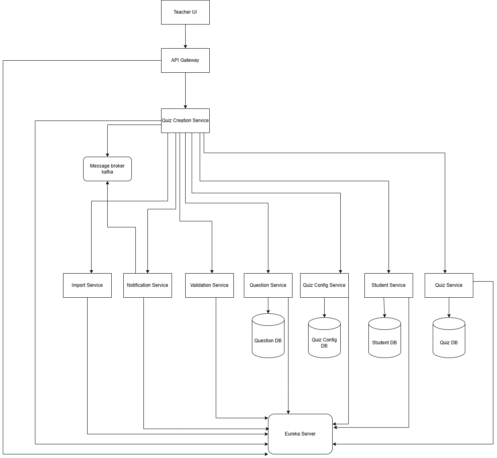

## Tổng quan
Hệ thống tạo bài thi trắc nghiệm được thiết kế theo kiến trúc microservices để xử lý toàn bộ quy trình từ khi giáo viên tạo bài thi đến khi sinh viên hoàn thành bài thi. Hệ thống được chia thành các dịch vụ độc lập, mỗi dịch vụ chịu trách nhiệm cho một phần cụ thể của quy trình, cho phép phát triển, triển khai và mở rộng độc lập.

## Thành phần hệ thống

### Microservices

- **Quiz Creation Service**: Điều phối toàn bộ quy trình tạo bài thi trắc nghiệm, từ import danh sách câu hỏi, cấu hình bài thi, danh sách sinh viên, và xác thực các dữ liệu liên quan. Service này được xây dựng bằng Java Spring Boot và sử dụng MySQL để lưu trữ dữ liệu.

- **Question Service**: Quản lý danh sách câu hỏi được nhập vào và xử lý xác thực. Service này được xây dựng bằng Java Spring Boot và sử dụng MySQL để lưu trữ dữ liệu câu hỏi.

 **Quiz Service**: Quản lý các bài thi đã được tạo, bao gồm thông tin về bài thi, câu hỏi, và kết quả. Service này được xây dựng bằng Java Spring Boot và sử dụng MySQL để lưu trữ dữ liệu bài thi. Nó cung cấp API để truy xuất và quản lý thông tin bài thi.

- **Quiz Config Service**: Quản lý cấu hình của bài thi trắc nghiệm, bao gồm thời gian, số lượng câu hỏi, điểm số, và các quy định khác. Service này được xây dựng bằng Java Spring Boot và sử dụng MySQL để lưu trữ dữ liệu cấu hình.

- **Student Service**: Quản lý danh sách sinh viên tham gia thi, bao gồm việc xác thực tên hoặc mã sinh viên. Service này được xây dựng bằng Java Spring Boot và sử dụng MySQL để lưu trữ dữ liệu sinh viên.

- **Validation Service**: Xác thực tính hợp lệ của các danh sách nhập vào hệ thống (danh sách câu hỏi, cấu hình bài thi, danh sách sinh viên). Service này được xây dựng bằng Java Spring Boot và sử dụng MySQL để lưu trữ dữ liệu xác thực.

- **Import Service**: Xử lý việc import thủ công các danh sách (danh sách câu hỏi, cấu hình bài thi, danh sách sinh viên) vào hệ thống. 

- **Notification Service**: Xử lý việc gửi thông báo đến người dùng thông qua các kênh khác nhau như email. Service này được xây dựng bằng Java Spring Boot và sử dụng Kafka để nhận các sự kiện thông báo từ các service khác. Nó tích hợp với SMTP để gửi email thông báo, bao gồm mã bài thi đến sinh viên.

### Thành phần hỗ trợ

- **API Gateway**: Đóng vai trò là điểm vào duy nhất cho tất cả các yêu cầu từ client, định tuyến yêu cầu đến các services phù hợp, xử lý xác thực và bảo mật. Được xây dựng bằng Spring Cloud Gateway.

- **Service Discovery (Eureka Server)**: Quản lý việc đăng ký và khám phá các dịch vụ trong hệ thống, cho phép các dịch vụ giao tiếp với nhau mà không cần biết địa chỉ cụ thể.

- **Message Broker (Kafka)**: Hỗ trợ giao tiếp bất đồng bộ giữa các services, đảm bảo tính nhất quán dữ liệu.

- **Database**: MySQL được sử dụng làm cơ sở dữ liệu chính cho tất cả các services.

## Giao tiếp giữa các services

### Giao tiếp đồng bộ (REST APIs)

- **Client <-> API Gateway**: Client giao tiếp với hệ thống thông qua API Gateway sử dụng REST APIs.
- **API Gateway <-> Services**: API Gateway định tuyến yêu cầu đến các services phù hợp thông qua REST APIs.
- **Service <-> Service (truy vấn)**: Các services có thể truy vấn trực tiếp đến các services khác thông qua REST APIs khi cần dữ liệu ngay lập tức.

### Giao tiếp bất đồng bộ (Kafka)

- **Event-driven Communication**: Các services giao tiếp với nhau thông qua các sự kiện được phát hành và tiêu thụ qua Kafka.

### Mạng nội bộ

- Các services giao tiếp với nhau thông qua tên service được định nghĩa trong Docker Compose.
- Mỗi service được cấp một địa chỉ IP riêng trong mạng Docker.
- Service Discovery (Eureka) giúp các services tìm thấy nhau trong mạng.

## Luồng dữ liệu 

### Quy trình tạo bài thi

1. **Bắt đầu từ giáo viên**:
   - Giáo viên tương tác với hệ thống thông qua API Gateway
   - API Gateway định tuyến yêu cầu đến Quiz Creation Service

2. **Quiz Creation Service điều phối toàn bộ quy trình**:
   - Quiz Creation Service gọi đến Import Service để thực hiện nhập các dữ liệu:
     - Danh sách câu hỏi
     - Danh sách sinh viên

3. **Validation Service xử lý xác thực**:
   - Sau khi dữ liệu được Import, Quiz Creation Service gửi dữ liệu đến Validation Service để xác thực
   - Nếu dữ liệu không hợp lệ, Validation Service trả về lỗi → hệ thống hiển thị thông báo lỗi và dừng quy trình
   - Nếu hợp lệ, Validation Service gửi dữ liệu đã xác thực đến các Entity Services tương ứng

4. **Ghi nhận dữ liệu đã xác thực vào các Entity Services**:
   - Question Service lưu các câu hỏi hợp lệ
   - Quiz Config Service lưu cấu hình hợp lệ
   - Student Service lưu danh sách sinh viên hợp lệ

5. **Tạo bài thi và gửi mã**:
   - Khi toàn bộ dữ liệu đã xác thực và lưu trữ thành công, Quiz Creation Service tổng hợp lại:
     - Truy xuất câu hỏi, cấu hình, danh sách sinh viên từ các Entity Service
     - Sinh ra một mã bài thi (quiz code) tương ứng
     - Gửi mã bài thi + thông báo đến sinh viên tham gia thi

### Phụ thuộc bên ngoài

- **Hệ thống email**: Để gửi thông báo và mã bài thi đến sinh viên.

## Sơ đồ kiến trúc hệ thống

*Hình 1: Sơ đồ kiến trúc tổng thể của hệ thống tạo bài thi trắc nghiệm*

## Khả năng mở rộng & Khả năng chịu lỗi

### Khả năng mở rộng

- **Mở rộng theo chiều ngang**: Mỗi service có thể được mở rộng độc lập bằng cách thêm nhiều instances, tùy thuộc vào tải.
- **Cân bằng tải**: API Gateway và các service instances có thể được đặt sau load balancer để phân phối tải.
- **Service Discovery**: Eureka Server giúp quản lý việc mở rộng các dịch vụ một cách linh hoạt.

### Khả năng chịu lỗi

- **Service Independence**: Các services hoạt động độc lập, nếu một service gặp sự cố, các service khác vẫn có thể hoạt động.
- **Retry Mechanism**: Triển khai cơ chế thử lại cho các yêu cầu thất bại
